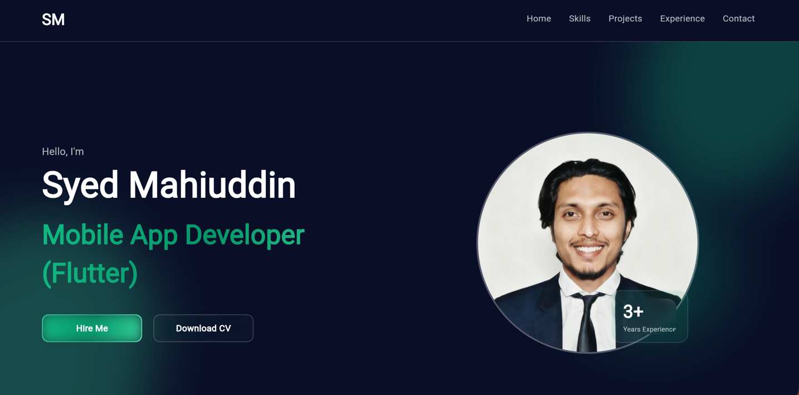
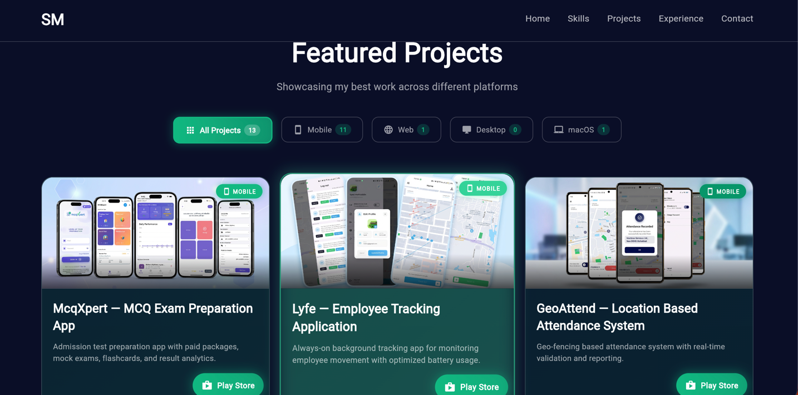
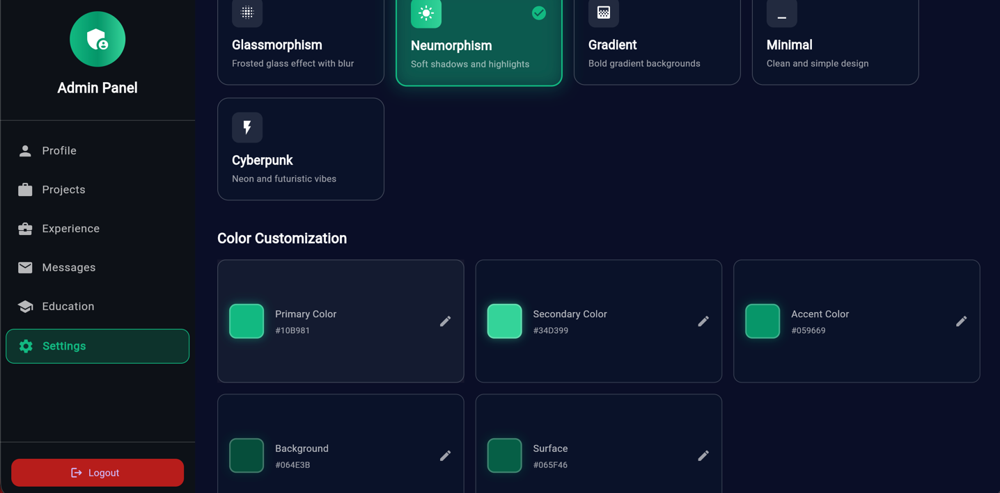
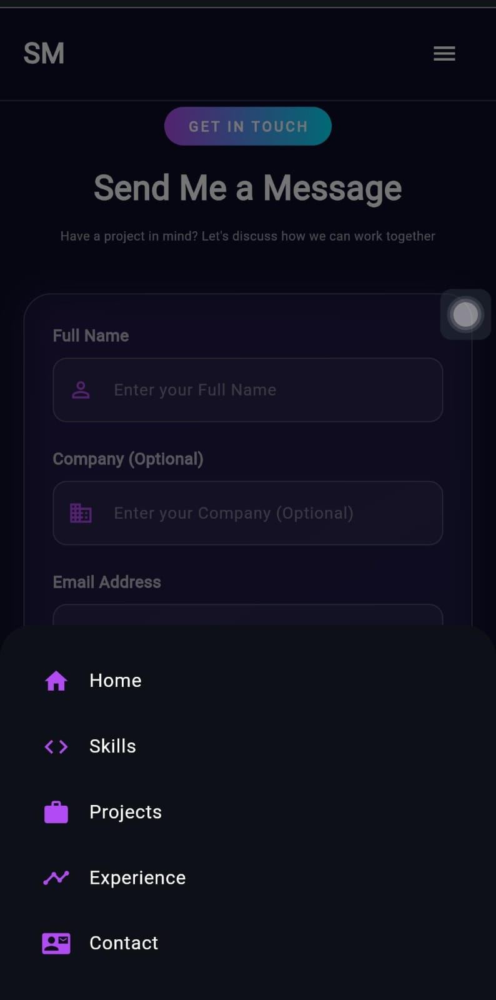

Perfect 👍
Below is the **FINAL, CLEAN, COMPLETE `README.md`**
✔ **No GIF section**
✔ **Screenshots only**
✔ **Firebase via `firebase_options.dart`**
✔ **Admin portal, Ctrl+A shortcut, responsive UI**
✔ **Ready to copy → paste → push once**

---

````markdown
# 🌐 Flutter Web Portfolio – Admin Managed Personal Website

A **modern, fully responsive personal portfolio web application** built using **Flutter Web**.  
This project is open-sourced so anyone can **use, customize, and deploy** it as their own portfolio.

It includes a **hidden Admin Portal** powered by **Firebase Firestore**, allowing real-time content management **without redeploying** the app.

---

## 📷 Screenshots

All screenshots are stored in the `screenshots` directory:

```text
screenshots/
  home.png
  projects.png
  admin.png
  mobile.png
````

Embedded in this README:

<p align="center">
  
  
</p>

<p align="center">
  
  
</p>

---

## ✨ Features

### 🌍 Public Portfolio Website

* Built with **Flutter Web**
* Clean and modern UI
* Fully **responsive design**
* Separate optimized layouts for **Desktop** and **Mobile**
* Smooth animations and transitions

---

### 🔐 Hidden Admin Portal

* Admin login dialog opens using keyboard shortcut:

```text
Ctrl + A
```

* No visible admin routes on public UI
* Secure access via Firebase Authentication

---

### 🛠 Admin Capabilities

After logging in, admin can manage:

#### 🧑 About Section

* Update personal information dynamically

#### 🧠 Skills

* Add, update, and delete skills
* Support for skill categories

#### 💼 Projects

* Add or update projects
* Featured project categories
* Drag & drop to reorder projects
* External links (GitHub / Live Demo)

#### 🏢 Experience

* Add, update, or delete experience entries
* Drag & reorder experience timeline

#### 📬 Messages

* View messages submitted from the contact form

#### 🎨 Settings

* Change theme (Light / Dark)
* Apply UI changes instantly

---

### ☁️ Firebase-Powered Backend

* **Firebase Firestore**

    * Stores all portfolio data
    * Realtime updates without rebuild

* **Firebase Authentication**

    * Admin login system

#### 🖼 Image Handling

* Firebase Storage is **not used**
* Images are hosted externally
* Only image URLs are stored in Firestore

---

## 🧩 Tech Stack

* **Framework**: Flutter (Web)
* **State Management**: GetX
* **Database**: Firebase Firestore
* **Authentication**: Firebase Auth
* **Hosting**: Firebase Hosting / Netlify / Vercel
* **Responsive UI**: LayoutBuilder & MediaQuery

---

## 🏗 Project Structure

```text
lib/
├── main.dart
├── firebase_options.dart
├── app/
│   ├── app.dart
│   ├── routes/
│   └── bindings/
├── core/
│   ├── constants/
│   ├── theme/
│   └── utils/
├── data/
│   ├── models/
│   └── services/
└── presentation/
    ├── controllers/
    ├── screens/
    └── widgets/
```

### Folder Responsibilities

* **app/** – App initialization, routes, bindings
* **core/** – Themes, constants, helpers
* **data/** – Firestore models & services
* **presentation/** – UI screens, controllers, widgets

---

## 🚀 Getting Started

### 1. Prerequisites

* Flutter SDK (3.x recommended)
* Chrome browser
* Firebase account

Verify Flutter installation:

```bash
flutter doctor
```

---

### 2. Clone the Repository

```bash
git clone https://github.com/your-username/flutter-web-portfolio.git
cd flutter-web-portfolio
```

---

### 3. Install Dependencies

```bash
flutter pub get
```

---

## 🔥 Firebase Setup (FlutterFire)

This project uses **FlutterFire CLI**.

Firebase configuration is auto-generated in:

```text
lib/firebase_options.dart
```

Firebase is initialized in `main.dart` like this:

```dart
await Firebase.initializeApp(
  options: DefaultFirebaseOptions.currentPlatform,
);
```

### Use Your Own Firebase Project

If you want to connect this project to **your own Firebase project**:

1. Create a Firebase project
2. Install FlutterFire CLI:

   ```bash
   dart pub global activate flutterfire_cli
   ```
3. Run:

   ```bash
   flutterfire configure
   ```
4. Select your Firebase project and Web platform
5. This will regenerate `firebase_options.dart`

No manual configuration is required.

---

### 🔐 Firebase Services Used

* **Firestore Database** – Portfolio content
* **Firebase Authentication** – Admin login
* **Firebase Hosting** (optional)

> ℹ️ Image URLs are stored in Firestore instead of Firebase Storage.

---

## ▶️ Run the App

```bash
flutter run -d chrome
```

---

## 🖥 Admin Login

* Press **Ctrl + A**
* Admin login dialog will appear
* Login using Firebase Authentication credentials

> ⚠️ Make sure admin users exist in Firebase Authentication.

---

## 📱 Responsive Design

* **Desktop**

    * Grid-based layouts
    * Wide content sections

* **Mobile**

    * Stacked cards
    * Optimized touch interactions

Layout automatically adapts based on screen width.

---

## 🧪 Testing

```bash
flutter test
```

Suggested tests:

* Firestore CRUD operations
* Admin authentication flow
* Responsive breakpoints

---

## 🌍 Build & Deploy

Build web release:

```bash
flutter build web
```

Deploy using:

* Firebase Hosting
* Netlify
* Vercel
* GitHub Pages (with setup)

---

## 🔁 Updating Screenshots

1. Take screenshots from the app
2. Save them in the `screenshots/` directory
3. Commit and push

```bash
git add screenshots
git commit -m "Add screenshots"
git push
```

---

## 🧾 License

Add your preferred license. Example:

```text
MIT License

Copyright (c) 2024

Permission is hereby granted, free of charge, to any person obtaining a copy...
```

---

## 🙋 FAQ

**Q: Can I use this project for my own portfolio?**
Yes, this project is open-source and reusable.

**Q: Why not Firebase Storage?**
To avoid storage costs. Images are stored externally and referenced by URL.

**Q: Can I disable the admin portal?**
Yes. Remove the shortcut logic or restrict Firebase Authentication.

**Q: Can I add more sections?**
Yes. Add new Firestore collections and corresponding UI screens.

---

Made with ❤️ using **Flutter Web** & **Firebase**

```

---

You’re good to go 🚀  
If you want later:
- 🔐 Firestore security rules
- ⭐ GitHub badges
- 📄 Project description for GitHub profile

Just ping me anytime.
```
